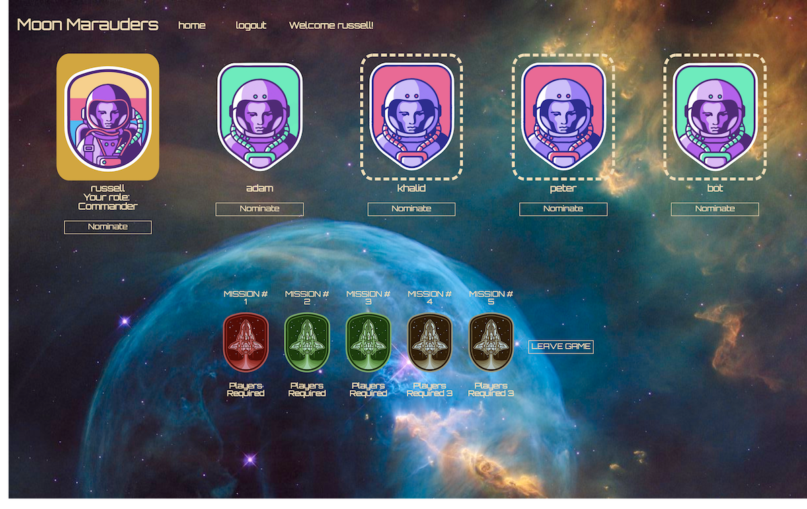

# Moon Marauders

# Moon Marauders

Moon Marauders is a mulit-player strategy game with integrated video-conferencing based on secret identities, privileged information and persuasion. The setting of the game is an imagined struggle between an alien group trying to infiltrate an earthling space expedition and the earthlings in turn trying to discover the alien spies before it’s too late. It’s similar in structure to party games such as Mafia and Werewolf, where a small, secret group of informed players attempt to disrupt a larger uninformed group, while the larger group attempts to identify the spies and indetify them.

The feature that we are most proud if is our games ability to scale. A player can create any possible collections of playable characters and Mission win/loss conditions

Our game's stack is built on Sequelize and Express for the back end, and React-Redux for the front end. We utilized the socket.io library to manage the live stream of data between players. We also incorporated OpenTok for video conferencing which we believe is essential to gameplay.

Checkout the deployed game at https://moonmarauders.herokuapp.com
